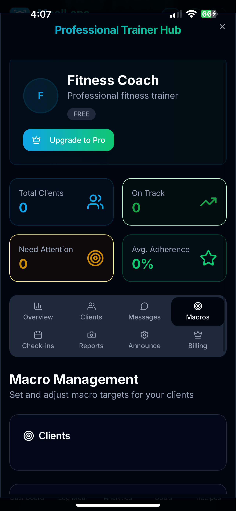

# meallensai_showcase
Showcase repo for MealLensAI – AI powered calorie tracker with trainer client hub.

# MealLensAI

## Overview
MealLensAI is an AI powered nutrition tracker with a built in trainer client hub. Users snap a photo of a meal to get instant macro estimates and save entries to a daily log. Trainers view client logs in real time and can adjust targets without spreadsheets or manual check ins.

## Problem
Manual food logging is slow and often inaccurate. Trainers struggle to monitor client intake because most apps are built only for individuals, not coaching workflows.

## Solution
MealLensAI automates meal logging with image recognition and extends the tracker into a coaching platform. Clients log meals with photos, upload progress photos for check ins, while trainers monitor compliance, adjust targets, and provide accountability from a central hub.

## Features
* AI meal recognition with auto macro breakdown  
* Nutrition lookup from food databases with 4 9 4 macro fallback  
* Daily goal progress bar with traffic light indicators  
* Profile settings for units and macro presets  
* Secure data storage with Supabase Row Level Security  
* Trainer client hub to view logs, adjust targets, and track progress  
* Client progress photos visible to assigned coaches for visual check ins  
* Trainer controls to edit client calorie goals and macro targets in app

## Tech Stack
* Frontend: React Native with Expo  
* Backend: Supabase Postgres plus Edge Functions  
* APIs: LogMeal image recognition, USDA FoodData Central  
* Auth: Supabase Auth with Row Level Security  

## Trainer Client Hub (What Sets It Apart)
Most calorie trackers stop at the individual level. MealLensAI includes a trainer dashboard where coaches can  
* View client food logs in real time  
* Adjust calorie and macro targets remotely directly in the app  
* Review client progress photos for visual compliance and physique trends  
* Monitor adherence and detect patterns without spreadsheets or manual check ins

## Progress Photos
Clients can upload progress photos directly in the app. Assigned coaches see these photos alongside daily logs and targets. This creates a simple weekly or monthly check in flow and gives trainers context when adjusting calories and macros.

## Database Design and Security
The schema supports both client tracking and trainer dashboards  
* Clients can only view and manage their own entries and photos  
* Trainers can view entries and photos for their assigned clients through the trainer_clients join table  
* RLS policies Row Level Security ensure strict access control for privacy and security  

See [schema.sql](snippets/schema.sql) and [policies_readme.md](snippets/policies_readme.md) for full table definitions and example RLS policies.

## Screenshots

### Dashboard
  
  
  

### Logging Meals
  

### Goals
  
  

### Profile
  
  

### Trainer Hub
  
  
  
  

### Recipes
  

### Subscription
  

## Roadmap
* Apple Health and Google Fit integration  
* Push notifications for meal logging and coach reminders  
* Weekly trainer reports and client insights  
* Improved portion guidance with sliders and plate size estimation  

## Lessons Learned
* Implementing secure row level policies for user data  
* Handling kcal versus kJ normalization in food databases  
* Designing dual flows that serve both clients and trainers  

## Demo
Demo video coming soon.

## License
MIT License for showcase repo. App code and brand remain private.
